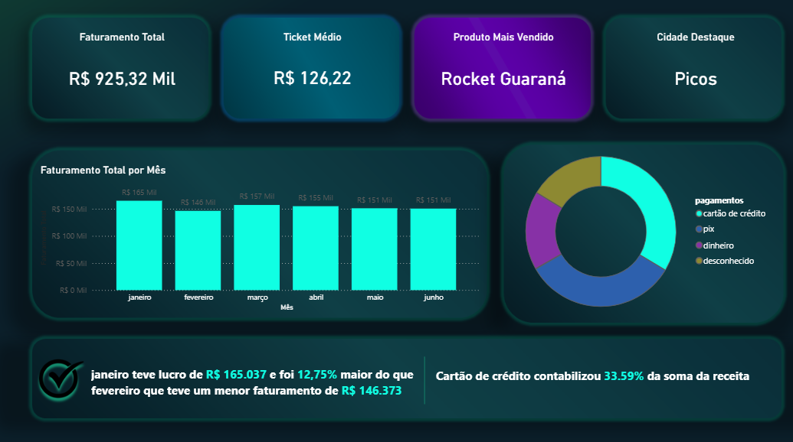

# Dashboard Financeiro

💼 Dashboard Financeiro — Desempenho Comercial

  
  
  
  

Dashboard gerencial com visão 360° do desempenho comercial — consolidando faturamento, mix de produtos, formas de pagamento e comportamento de pagamento dos clientes em um único painel estratégico.

🔗 [Ver Dashboard ao Vivo](https://app.powerbi.com/view?r=eyJrIjoiZmMxNDc0NjktMDJkZi00MWI4LWJhZmYtNzk1ZTVhMmQ3YmRlIiwidCI6IjdiNzZjYWM5LTBkYTQtNGNmZC1hZWY1LWEyNDgyNDI5NmYyMiJ9)

📌 Contexto do Projeto
Uma empresa contratou um analista de dados com o objetivo de entender melhor seu desempenho comercial e o comportamento financeiro dos seus clientes. O desafio era transformar dados dispersos em uma visão clara e estratégica que respondesse às principais dúvidas do negócio.
O dashboard foi desenvolvido para consolidar em um único painel as informações de faturamento, mix de produtos, formas de pagamento e comportamento de pagamento dos clientes — permitindo que gestores tomem decisões com mais segurança e agilidade.

❓ Perguntas de Negócio
Com o intuito de entender o desempenho comercial e o perfil financeiro dos clientes, as seguintes perguntas de negócio guiaram o desenvolvimento do projeto:
1 - Qual é a evolução do faturamento ao longo do tempo?
2 - Quais produtos mais contribuem para a receita da empresa?
3 - Onde estão concentrados os clientes e as vendas geograficamente?
4 - Quais são as formas de pagamento mais utilizadas pelos clientes?

🎯 Objetivo
Oferecer uma visão gerencial e estratégica do desempenho comercial, respondendo às perguntas mais críticas de um negócio: quanto estamos faturando, quais produtos impulsionam o resultado, onde estão nossos clientes e como eles estão pagando.

📋 Visões e Análises do Painel

💰 Faturamento
Acompanhamento da receita por período com análise de tendência, permitindo identificar crescimento, queda ou estabilidade no desempenho comercial ao longo do tempo.

📦 Análise de Produtos
Visão do portfólio com foco em quais produtos mais contribuem para o faturamento — apoiando decisões de mix, precificação e priorização de estoque.

💳 Comportamento de Pagamento
Análise dos padrões de pagamento dos clientes: formas preferidas, prazos e eventuais padrões de inadimplência — informações críticas para gestão de fluxo de caixa e políticas de crédito.

🧠 Metodologia
Coleta e Tratamento dos Dados

💡 Principais Insights que o Painel Revela

Concentração geográfica: identifica regiões com maior e menor penetração, orientando esforços de expansão
Mix de produtos: mostra quais itens sustentam o faturamento e quais têm participação marginal
Preferência de pagamento: tendências no comportamento de pagamento dos clientes ao longo do tempo
Sazonalidade de faturamento: variações mensais que permitem planejamento mais preciso de metas e recursos

🛠️ Ferramentas Utilizadas
Ferramenta Uso Power BI Desktop Construção do dashboard e visualizações Power Query ETL, tratamento e transformação dos dados DAX Medidas, KPIs e cálculos de negócioMapas do Power BI Visualização geográfica dos clientes Excel Base de dados fonte
